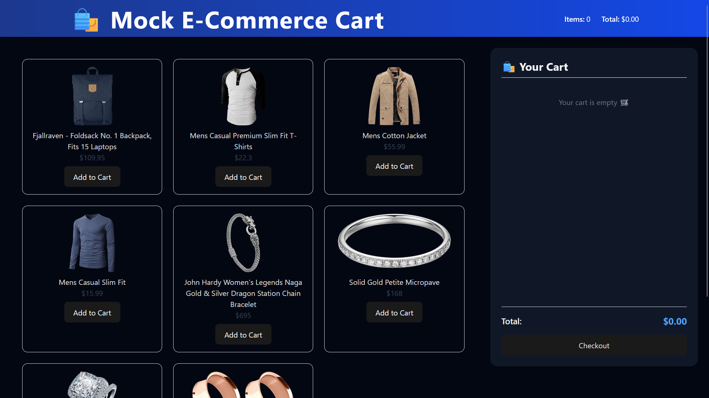
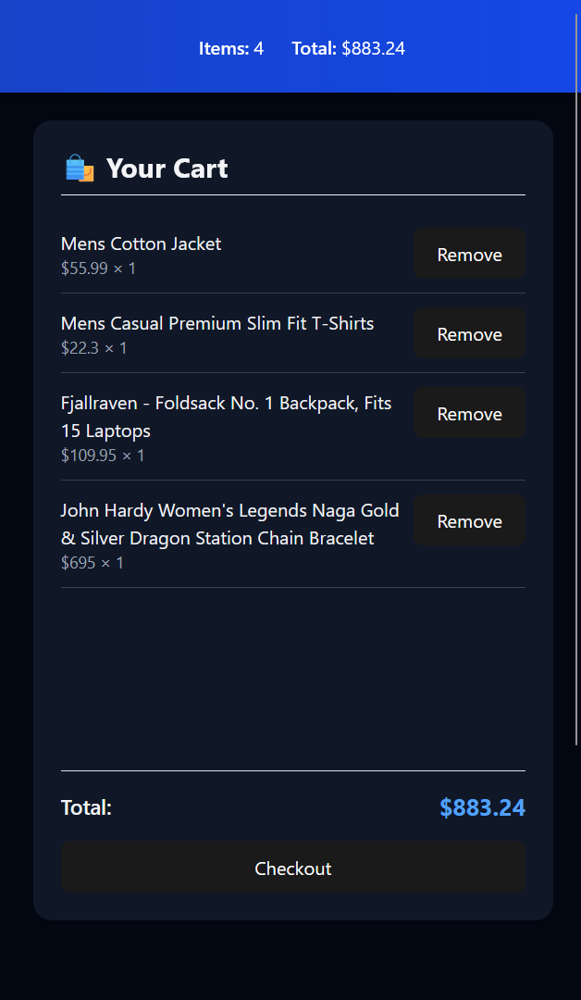
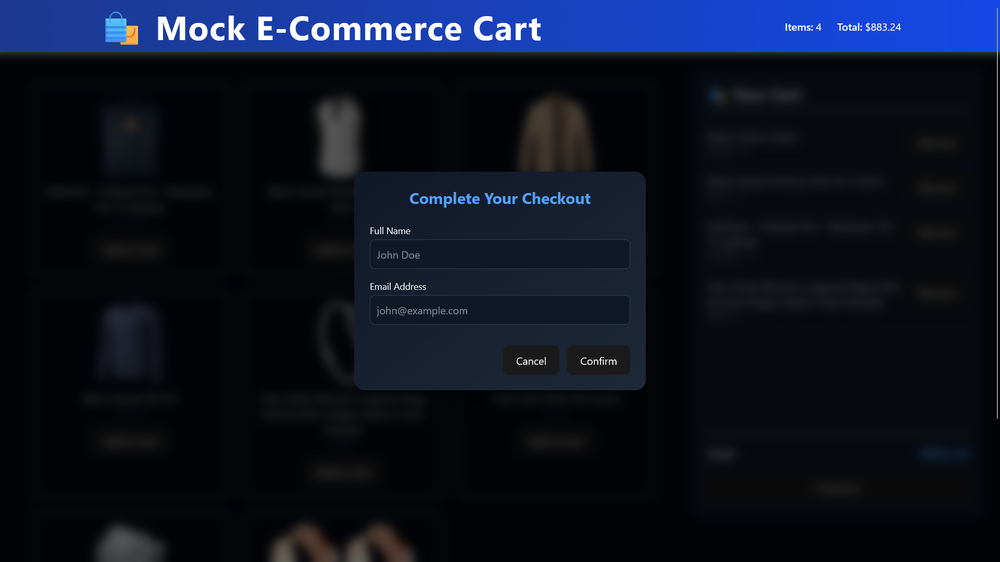

# 🛍️ Mock E-Commerce Cart

A simple yet elegant **mock e-commerce cart app** built using the **MERN stack**, showcasing core shopping cart functionalities like product display, add/remove items, checkout with user details, and receipt generation — all with a clean, responsive UI.

---

## 🚀 Features

- 🛒 **Add to Cart / Remove from Cart**
- 💰 **Live Total Price Calculation**
- 📋 **Persistent Cart per User (via User ID)**
- ✅ **Checkout with Name & Email Form**
- 🧾 **Dynamic Receipt Generation After Checkout**
- 💎 **Responsive & Modern UI with Tailwind CSS**
- 🌙 **Dark Mode Ready**
- ⚡ **Deployed and API-integrated**

---

## 🧱 Tech Stack

**Frontend:**
- React.js (Vite)
- Tailwind CSS
- Axios (API calls)
- Context API for State Management

**Backend:**
- Node.js
- Express.js
- MongoDB with Mongoose

---

---

## ⚙️ Setup Instructions

### 1️⃣ Clone the repository
```bash
git clone https://github.com/HummadP/mock-ecom-cart.git
cd mock-ecom-cart
```
### 2️⃣ Install dependencies
```bash
cd backend
npm install

cd ../frontend
npm install
```
###3️⃣ Configure environment variables
```bash
MONGO_URI=your_mongodb_connection_string
PORT=5000
```
###4️⃣ Run the app
```bash
cd backend
npm run dev

Frontend (in another terminal):
cd frontend
npm run dev
```
### Then Open
```bash
http://localhost:5173
```

## 🧾 App Preview

### 🏠 Homepage (Product Grid)


### 🛒 Cart Sidebar


### 💳 Checkout Form


### ✅ Receipt View

